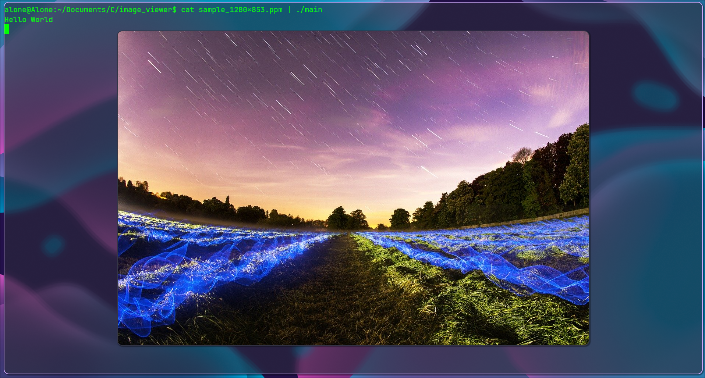

# SDL3 Image Viewer 

A lightweight image viewer written in pure C using SDL3.
Supports PPM (P3/P6) natively, and any other format automatically via ffmpeg.

## Dependencies

* **GCC** (or any C compiler)
* **SDL3**
* **ffmpeg** (runtime only, for non-PPM formats)

Install on Arch Linux:
```
sudo pacman -S sdl3 ffmpeg
```

## Build
```
gcc main.c -o viewer -lSDL3
```

## Usage
```bash
# file path - any format
./viewer image.ppm
./viewer photo.jpg
./viewer image.png

# stdin pipe - PPM
cat image.ppm | ./viewer

# stdin pipe - any format (auto converts via ffmpeg)
cat photo.jpg | ./viewer
```

## How it works

1. Reads the first 2 bytes to detect format magic number
2. If **P6** (binary PPM) → reads directly
3. If **P3** (ASCII PPM) → reads directly  
4. If **anything else** → pipes through ffmpeg and converts to PPM on the fly

## Features

- P3 (ASCII) and P6 (binary) PPM native support
- Auto converts JPG, PNG, BMP, GIF, WebP and any ffmpeg supported format
- Supports stdin piping
- Direct surface pixel writing for fast rendering
- Zero image libraries — only SDL3

## Screenshot



## License

MIT